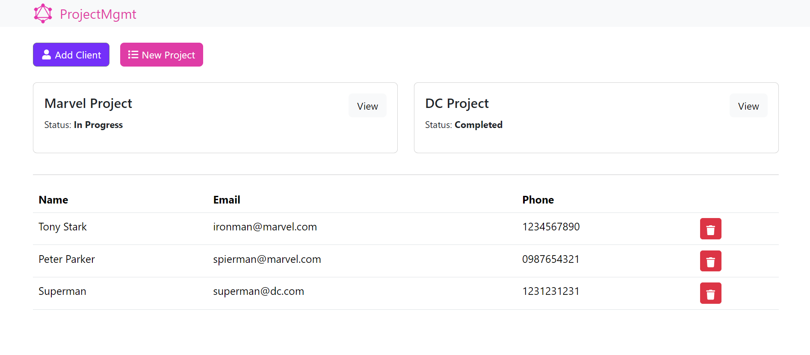
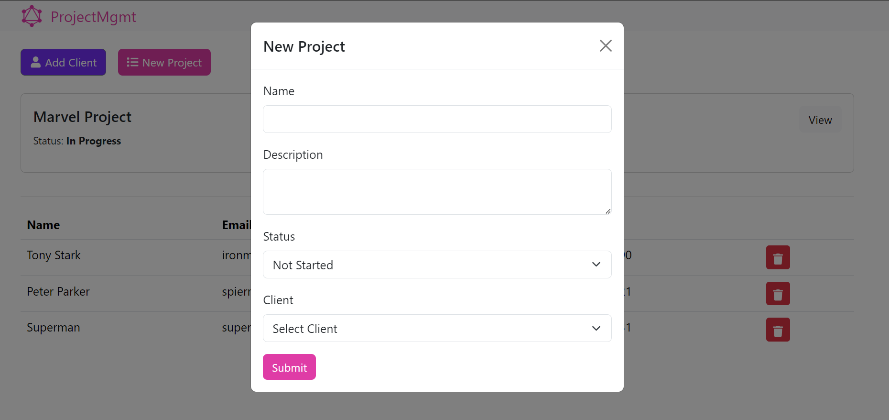

# Simple_Project_Management_System (Using GraphQL)
---

This is a comprehensive Fullstack CRUD application using MongoDB & GraphQL

## How to run
---
1. Install all dependencies
   
   -> In main directory

   `npm i`

   -> Inside client directory

   `npm i`
2. create at `.env` file and just like `.env.example` file
3. Run the backend server (in parent directory)
   `npm run dev`
4. Run react.js server 

```
cd client
npm start
```

## Sample Screenshots
---


